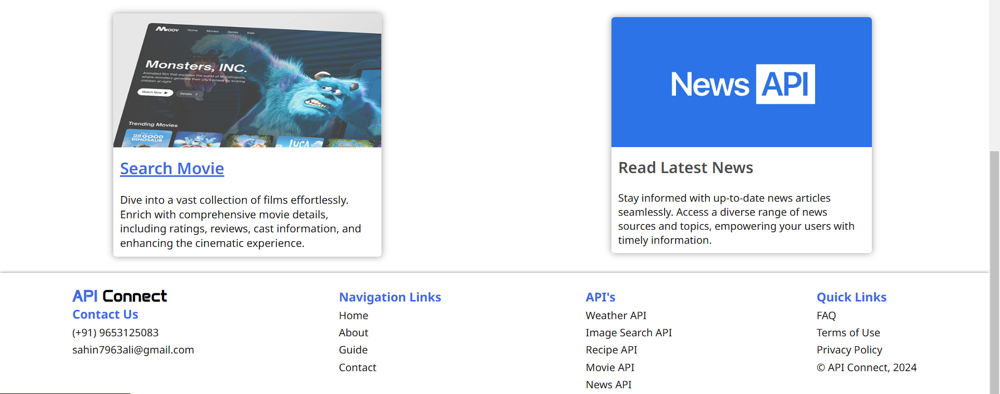

# API Connect

**API Connect** is a user-friendly platform designed to provide seamless access to a wide range of APIs. With a simple and intuitive interface, users can explore, integrate, and utilize APIs from various domains such as weather, image search, recipes, movies, and news.

---

## Screenshots

### Homepage



---

## Features

- **Weather API**: Access real-time weather data for your applications.
- **Image Search API**: Explore a vast repository of images effortlessly.
- **Recipe API**: Discover diverse culinary recipes and cooking instructions.
- **Movie API**: Dive into comprehensive movie details, including ratings and reviews.
- **News API**: Stay updated with the latest news articles across various topics.

---

## Live Demo

Visit the live demo: [API Connect](https://ssali07.github.io/api-connect/)

---

## Project Structure

The project is structured as follows:

```
API Connect/
├── css/
│   ├── index.css
│   └── responsive.css
├── js/
│   └── index.js
├── index.html
└── assets/
    └── images/
```

---

## Technologies Used

- **Frontend**: HTML5, CSS3, JavaScript
- **Styling**: Responsive design for better accessibility.
- **APIs Integrated**:
  - [Weather API](https://ssali07.github.io/WeatherCast/)
  - [Image Search API](https://ssali07.github.io/find-image/)
  - [Recipe API](https://ssali07.github.io/get-food-recipe/)
  - [Movie API](https://ssali07.github.io/find-movie/)
  - [News API](https://ssali07.github.io/news-api/)

---

## Installation and Usage

1. Clone the repository:
   ```bash
   git clone https://github.com/your-username/API-Connect.git
   cd API-Connect
   ```
2. Open the `index.html` file in your preferred browser to view the app locally.

---

## How It Works

1. Navigate through the provided links in the app.
2. Select the desired API from the available options.
3. You will be redirected to the specific API's interface, where you can search and fetch relevant data.

---


## Contact

For any queries or suggestions, feel free to reach out:
- **Email**: sahin7963ali@gmail.com
- **Phone**: (+91) 9653125083

---

## License

This project is licensed under the MIT License. See the `LICENSE` file for details.

---

## Contributing

Contributions are welcome! Please fork this repository and submit a pull request for any feature additions or bug fixes.
